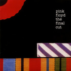
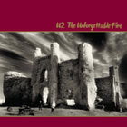
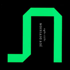
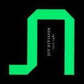
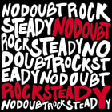
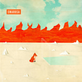
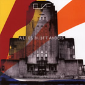
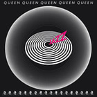
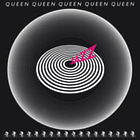
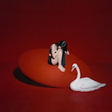

# Thumbnails

Musium generates a cached thumbnail per album, extracted from the embedded
cover art. The smaller thumbnails speed up the web-based library browser
substantially.

Initially, Musium used Imagemagick both for downsizing cover art, and for
encoding the thumnails as jpeg. However, better compressors exist, and for some
types of album art, in particular graphics with solid red areas, the thumbnails
generated by Imagemagick showed pretty bad artefacts. This document compares
compressors.

## Encoders considered (2019)

The following encoders were compared:

 * Imagemagick 7.0.9-10 Q16
 * Mozjpeg 3.3.1
 * Guetzli 1.0.1

These were used to encode 1216 downsized cover art images. They were downsized
from their native size to 140 × 140 pixels with Imagemagick through

    convert infile
        -colorspace LAB
        -filter Cosine
        -distort Resize 140x140!
        -colorspace sRGB
        -strip
        outfile.png

## Size

The cumulative size of all 1216 compressed thumbnails for various encoders:

| Size (bytes)   | Encoder     | Quality |
|---------------:|-------------|---------|
|     10,771,743 | Guetzli     | 95      |
|     11,926,551 | Guetzli     | 96      |
|     12,016,780 | Mozjpeg     | 92      |
|     12,889,658 | Imagemagick | 95      |
|     13,049,795 | Mozjpeg     | 93      |
|     13,605,461 | Guetzli     | 97      |
|     14,157,834 | Mozjpeg     | 94      |
|     14,254,799 | Imagemagick | 96      |
|     14,988,104 | Mozjpeg     | 95      |
|     19,531,105 | Mozjpeg     | 97      |
|     20,254,930 | Guetzli     | 99      |

The quality is the quality level passed to the encoder.

The goal of this investigation was to find the most appropriate replacement for
Imagemagick at quality 95 (which was used initially), but it is not obvious how
to make a fair comparison when the sizes differ so greatly.

Because the default of Imagemagick at quality 95 was a bit arbitrary, we can
instead compare the 3 options that are closest together in terms of size, for a
fairer comparison.

* Guetzli 96, Mozjpeg 92, Imagemagick 95, with a gap of 963,107 bytes.
* Imagemagick 95, Mozjpeg 93, Guetzli 97, with a gap of 715,803 bytes.
* Guetzli 97, Mozjpeg 94, Imagemagick 96, with a gap of 649,338 bytes.

This means we will involve Imagemagick at quality 96 instead of 95, so the
artefacts are not as bad, but they are still fairly apparent.

## Comparison

Below is a comparison of the thumbnails where artefacts were most apparent in
the images encoded by Imagemagick. This is not a general comparison of the
encoders; the focus is specifically on images where Imagemagick performed badly.
One thing that most of these images have in common, is that they contain solid
areas of bright red with sharp edges.

| Guetzli 97 | Mozjpeg 95 | Imagemagick 96 |
|------------|------------|----------------|
|  |  |  |
|  |  |  |
|  |  |  |
|  |  |  |
|  |  |  |
|  |  |  |
|  |  |  |
|  |  |  |
|  |  |  |
|  |  |  |
|  |  |  |
|  |  |  |
|  |  |  |
|  |  |  |
|  |  |  |
|  |  |  |

A few things stand out visually:

 * Both Guetzli and Mozjpeg perform much better than Imagemagick.
 * Where Imagemagick creates blurry edges, Mozjpeg creates sharp edges, but at
   the cost of ringing artefacts. Guetzli produces sharp edges without much
   ringing.

## Throughput

This comparison does not include timing information, but while running the
various compressors, it was clear that Guetzli is much slower than either
Imagemagick or Mozjpeg. For Musium this is not a big problem, because generating
thumbnails tends to be <abbr>IO</abbr>-bound when the files are one a a spinning
disk. As long as Guetzli is faster than the disk, it is fast enough.

## Conclusion

We should compress thumbnails with Guetzli to minimize visible artefacts.

## 2024 Update

[JPEG XL][jxl] exists nowadays, and it includes an improved encoder for
traditional jpeg, `cjpegli`. It’s a _lot_ faster than `guetzli`, should we
use it?

[jxl]: https://github.com/libjxl/libjxl

First, we need to find the right quality level. For this I sampled 369 album
covers at random from my library. I then performed binary search (with linear
interpolation) to find an adequate Butteraugli distance.

|Compressor| Quality | Total bytes | Avg. bytes | Size ratio | Total time (secs) |
|----------|--------:| -----------:|-----------:|-----------:| -----------------:|
| guetzli  | q=97    |   4,267,771 |     11,565 |     100.0% | 166.88 |
| cjpegli  | d=1.000 |   2,782,842 |      7,541 |      65.2% | 102.78 |
| cjpegli  | d=0.500 |   4,059,082 |     11,000 |      95.1% | 103.70 |
| cjpegli  | d=0.470 |   4,195,241 |     11,369 |      98.3% | 102.51 |
| cjpegli  | d=0.459 |   4,228,262 |     11,458 |      99.1% | 102.60 |
| cjpegli  | d=0.250 |   5,601,187 |     15,179 |     131.2% | 105.60 |

Here we see the total size of the 369 thumbnails as well as the average size per
thumbnail, and the ratio to the Guetzli target. The total time is only a single
measurement with no attempt to reduce variance, and it includes both resizing
with ImageMagick as well as encoding. In the case of `cjpegli`, the time is
dominated by resizing. Even without a proper benchmark it is clear that
`cjpegli` is faster.

After picking `--distance=0.459` as the quality level, I re-encoded 1839 album
covers with `cjpegli`. The average thumbnail size went from 11,583 bytes to
11,438 bytes, so quite close to the target.

Unfortunately, quality of the `cjpegli` thumbnails was noticeably worse for some
thumbnails, especially in the reds again:

| Guetzli 97 | Cjpeg 0.459 |
|------------|-------------|
|  |  |
|  |  |

For the first thumbnail, cjpegli creates visible blocking artifacts in the
background gradient, as well as ringing artifacts aroung the lower left edge of
the ellipse. Guetzli creates smoother gradients and tighter edges. This is no
surprise in this case, as the Guetzli image is 7,161 bytes whereas the cjpegli
one is only 5,762 bytes. For the second thumbnail, Guetzli preserves more detail
in the dark top-left corner. Again, the better quality is not entirely a
surprise, as Guetzli’s output is 22% larger in this case. Still, this (very
selective)
