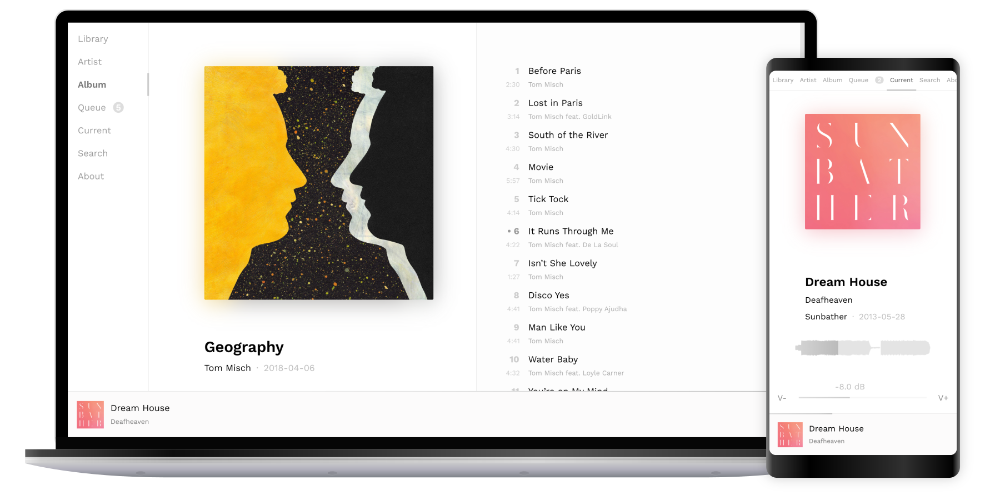

<h1 align="center"></h1>

[![Build Status][ci-img]][ci]

Musium is an album-centered music player. It is designed to run as a daemon on
an always-on device connected to speakers. Playback can be controlled from
anywhere on the local network through a webinterface.

 * [Overview and getting started guide](https://ruuda.github.io/musium/)
 * [Building](https://ruuda.github.io/musium/building/)
 * [Running](https://ruuda.github.io/musium/running/)

<a href="https://github.com/ruuda/musium/tree/master/screenshots">
  <!-- The png is the rasterized version of the svg. -->
  
</a>

## Status

Musium is in a usable state, but many features are still missing. For example,
there is no way to pause playback yet. I used it on a daily basis, and I focus
on building the most valuable features first.

## Alternatives

 * [MPD with a web client](https://musicpd.org/clients/#web-clients)
 * [Mopidy with Iris](https://mopidy.com/ext/iris/)

## License

Musium is licensed under the [Apache 2.0][apache2] license. It may be used in
free software as well as closed-source applications, both for commercial and
non-commercial use under the conditions given in the license. If you want to
use Musium in your GPLv2-licensed software, you can add an [exception][except]
to your copyright notice. Please do not open an issue if you disagree with the
choice of license.

[ci-img]:     https://travis-ci.org/ruuda/musium.svg?branch=master
[ci]:         https://travis-ci.org/ruuda/musium
[apache2]:    https://www.apache.org/licenses/LICENSE-2.0
[except]:     https://www.gnu.org/licenses/gpl-faq.html#GPLIncompatibleLibs
